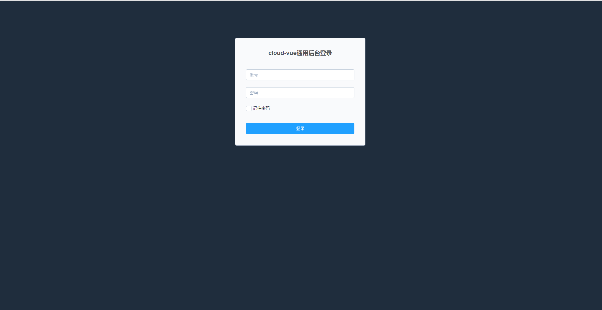
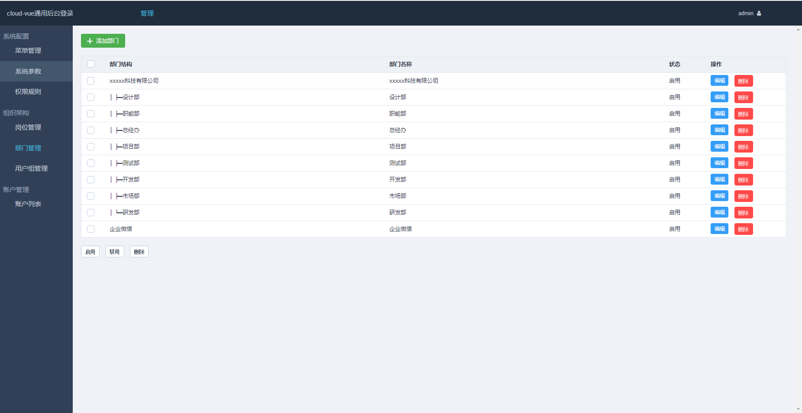
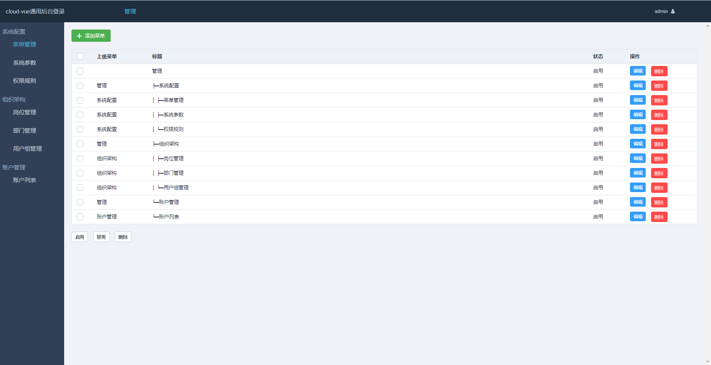
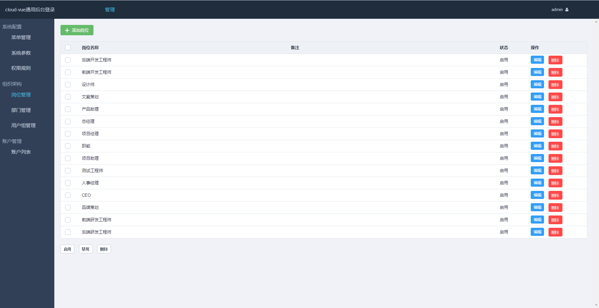
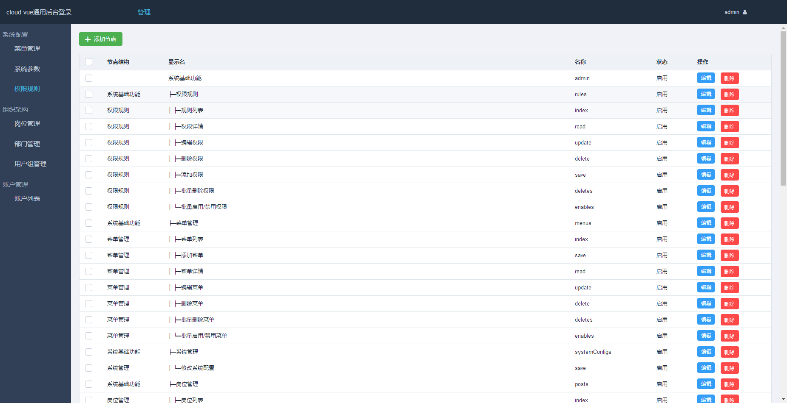
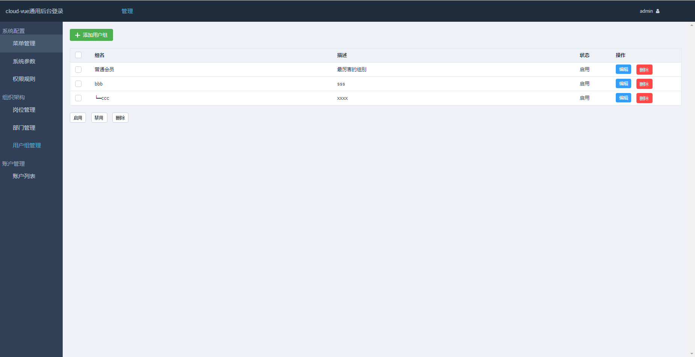
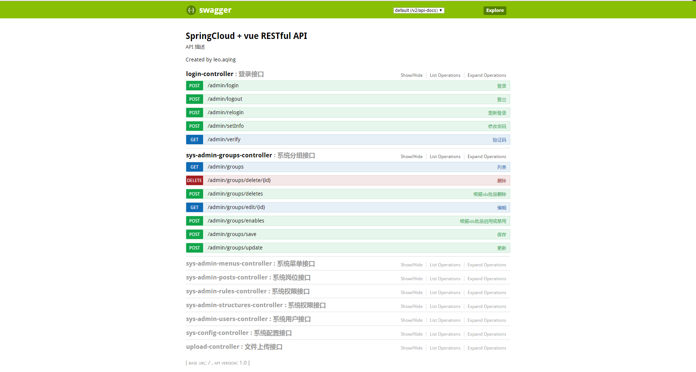

# SpringCloudAlibaba**
---

## 项目简介
* SpringCloudAlibaba集成环境搭建是一套基于springcloud + Gateway + Redis + Sentinel + Oauth2 + mybatis + vue全家桶（Vue2.x + Vue-router2.x + Vuex）的前后端分离框架.
* 使用Maven对项目进行模块化管理，提高项目的易开发性、扩展性。
* 系统包括分布式配置、Nacos集群注册中心、服务中心、Skywalking分布式跟踪等。
* 每个模块服务多系统部署，注册到同一个Nacos集群服务注册中心，实现集群部署。

## 主要功能
* 登录、退出登录
* 修改密码、记住密码
* 菜单管理
* 系统参数
* 权限节点
* 岗位管理
* 部门管理
* 用户组管理
* 用户管理

## 依赖
### java后端依赖环境
* Maven 3
* Java 8
* MySQL 5.7+
* Docker 1.13.1 (不是必须的)

### vue2前端依赖环境
* node >= 6.9.0
* npm  >= 3.0.0
* vue 				<https://vuefe.cn/v2/guide/>
* element-ui@1.1.3  <http://element.eleme.io/1.1/#/zh-CN/component/installation>
* axios  			<https://github.com/mzabriskie/axios>
* fontawesome 		<http://fontawesome.io/icons/>
* js-cookie  		<https://github.com/js-cookie/js-cookie>
* lockr  			<https://github.com/tsironis/lockr>
* lodash  			<http://lodashjs.com/docs/>
* moment  			<http://momentjs.cn/>

## 工程说明
* SpringCloudAlibabaAuth：权限认证。
* SpringCloudAlibabaShardingSphere：分开分表。
* SpringCloudAlibabaFlowable：自定义工作流微服务：未实现。
* SpringCloudAlibabaRedisService：自定义Redis微服务。
* SpringCloudAlibabaStreamKafka：自定义集成kafka微服务。
* SpringCloudAlibabaVueCould：自定义系统登陆微服务。
* SpringCloudAlibabaGateway：自定义网关微服务。
* SpringCloudAlibabaOrder：自定义订单微服务。
* SpringCloudAlibabaStock：自定义库存微服务。
* Skywalking：分布式链路调用监控系统，聚合各业务系统调用延迟数据，达到链路调用监控跟踪，但需要更改配置，把数据持久化到mysql，需要下载Skywalking的apm和agent
              微服务启动拼接：-javaagent:D:\User\Idea\myWorkSpace\skywalking-agent\skywalking-agent.jar -DSW_AGENT_NAME=oeder-service -DSW_AGENT_COLLECTOR_BACKEND_SERVICES=192.168.176.133:11800。
* sentinel-dashboard.jar：限流器服务。
* seata-server-1.3.0：分布式事务服务：需要把数据持久化到mysql,并把配置读取到nacos，网上搜索操作步骤
* cloud-vue : vue（Vue2.x + Vue-router2.x + Vuex)的前端项目

## 部署说明
 * 导入SpringCloudAlibabaAuth的auth.sql到mysql数据库。
 * 导入SpringCloudAlibabaVueCould的cloud-vue.sql到mysql数据库。
 * 导入SpringCloudAlibabaOrder的seate-order.sql到mysql数据库。
 * 导入SpringCloudAlibabaStock的seate-stock.sql到mysql数据库。
 * 修改SpringCloudAlibabaConfig的数据库配置文件
 * 打包命令 mvn package -DskipDockerBuild
 * 依次启动nacos、seata服务、SpringCloudAlibabaGateway、SpringCloudAlibaba**.jar。

## 效果图

## License
cloud-vue 基于apache2.0 <http://www.apache.org/licenses/LICENSE-2.0>
